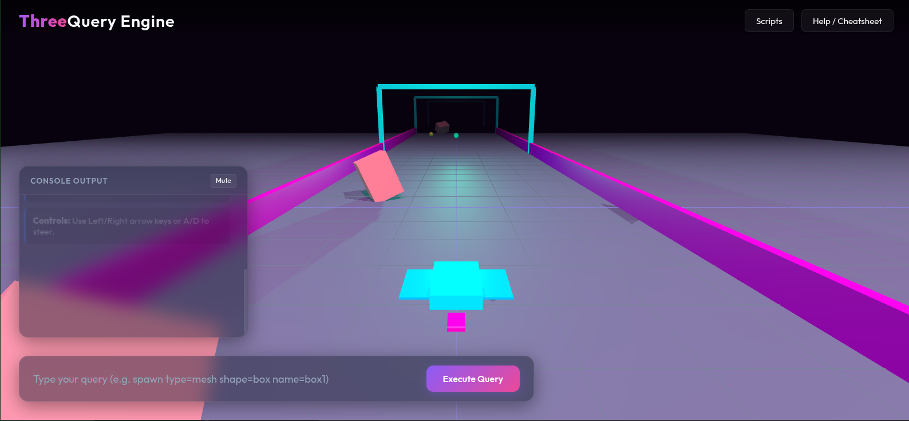

# ThreeQuery Engine 🚀

> **Creating Interactive 3D has never been easier for LLMs!**



Traditional 3D development requires writing hundreds of lines of complex Three.js boilerplate, managing animation loops, and wiring up physics engines. For Large Language Models (LLMs), writing or modifying complex boilerplate code directly can lead to syntax errors, context window bloat, and fragile runtime states.

**ThreeQuery Engine** solves this by offering a declarative query language and runtime scripting API designed specifically to be LLM-friendly.

---

## Why ThreeQuery is Perfect for LLMs

1. **Declarative 3D Queries**: Instead of writing complex JavaScript code to instantiate meshes, lights, or groups, LLMs can execute single-line naturalistic command queries:
   `spawn type=mesh shape=box color=#00f2fe position=0,2,0`
2. **Built-in Animation Loop**: Animating translations and rotations continuous or key-driven requires zero boilerplate:
   `modify name=player moveSpeed=10 moveDirection=left moveInput=left_arrow`
3. **Instant Physics & Collisions**: Add Rapier 3D physics with a single query line:
   `spawn type=collision target=player shape=box static=false`
4. **Targeted JS Script Injection**: Inject highly scoped, custom JavaScript snippets targeting individual objects to build custom gameplay loops, collision resets, or custom cameras.

---

## Quick Start

### 1. Install Dependencies
```bash
npm install
```

### 2. Launch the Engine
```bash
node server.js
```
Open [http://localhost:3000](http://localhost:3000) in your web browser.

### 3. Build a Cyberpunk Game via Bash
Run the included demo shell script to watch ThreeQuery build a complete, interactive grid runner game in real time:
```bash
chmod +x example.sh
./example.sh
```

---

## Resources
*   See [skill.md](skill.md) for a compact cheatsheet of all query commands, JS engine properties, and scripting APIs.

---
Developed by **Jonathan Uwumugisha**
